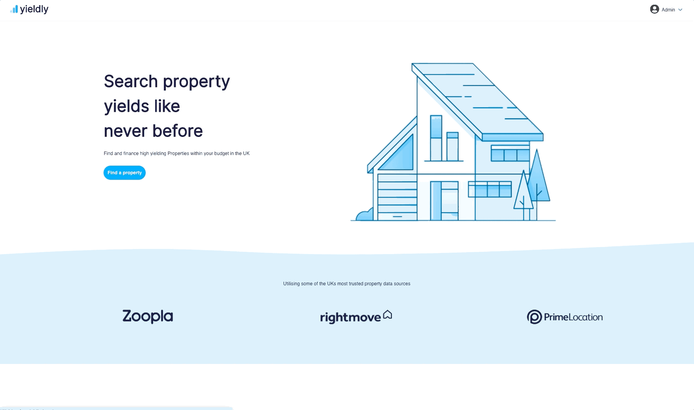
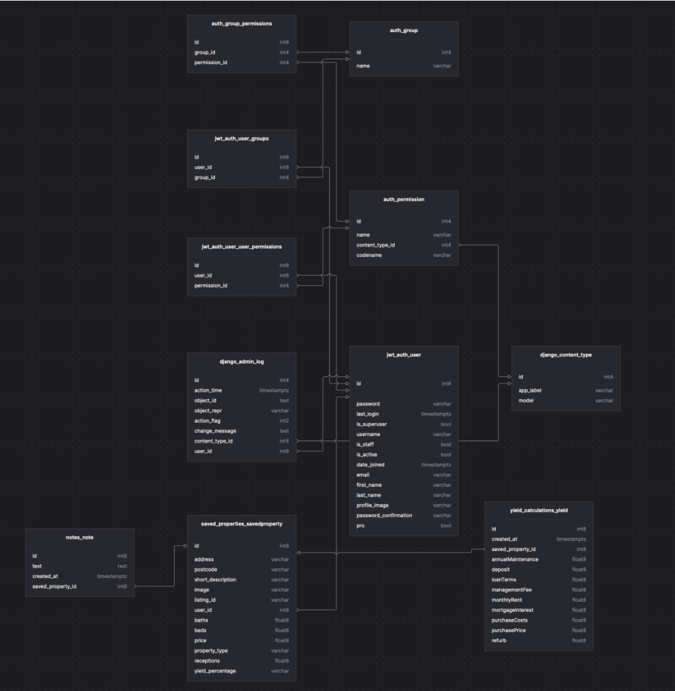
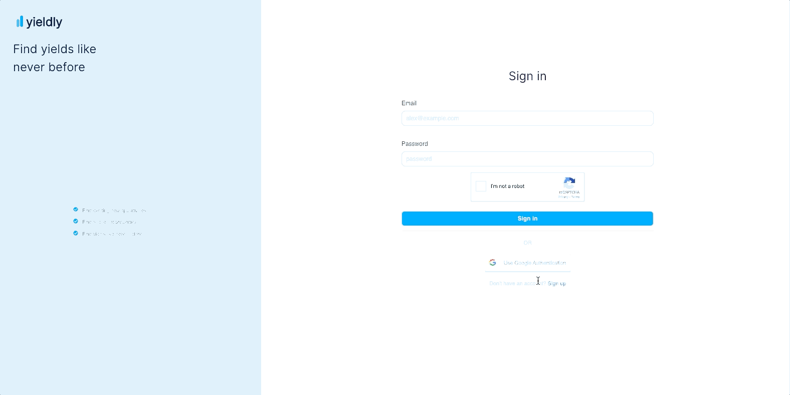
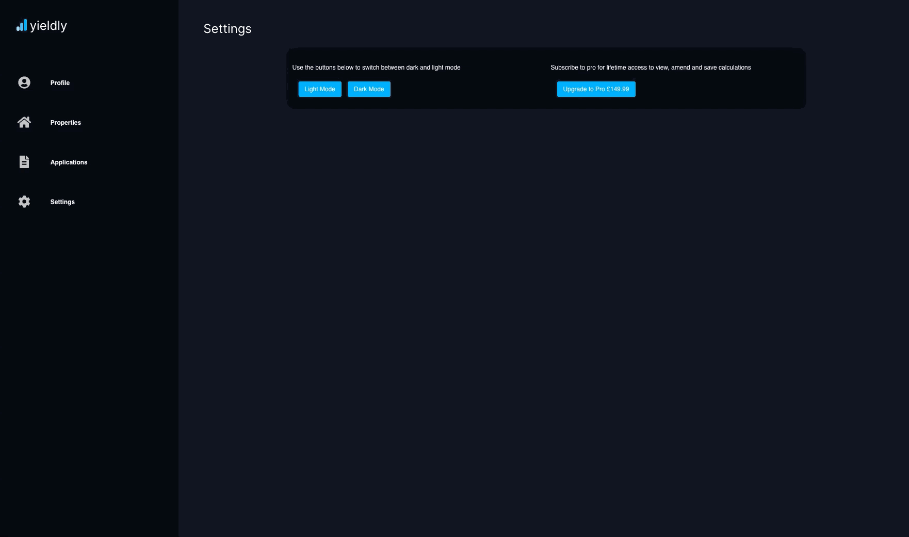

# General Assembly Project Four - Yieldly

### Timeframe
8 days

### Group Members
- Atila Arslan - https://github.com/Atilla-Arslan
- Jacqueline de Leeuw - https://github.com/jacquelinedeleeuw

## Project Overview
This was my final project on my General Assembly Software Engineering Immersive Course. We were given the challenge of creating a full stack web application with a Django backend in one week.

I decided to work on this project in a pair. Together we came up with the idea of a web app that would allow Buy to Let property investors make more informed decisions about their investments at the point of search.

The idea is simple, we request data from property websites such as Zoopla and Rightmove and use this information to find properties that match an investors, investment criteria, budget, location etc and return to them the best yielding buy to let investments, through a combination of changeable dummy variables, such as interest rate and deposit, as well as an average rental figure for that postcode. 

Overall we both worked an equal amount on the front end and back end, implementing a number of features such as API requests, connected back end relationships, complex mathematical calculations, Google auth0, reCaptcha, Dark Mode and Stripe Payments. 

## Deployed version
https://yieldly.herokuapp.com/



### Project Brief
- To build a full-stack application, making our own back end and front end.
- To use a Python Django API, using Django REST Framework to serve data from a Postgres database.
- To build the frontend using React to consume the API.
- The API should have multiple relationships and CRUD functionality for at least a couple of models.

### Technologies used:
#### Frontend:
- HTML5
- SASS/ CSS
- Bulma
- JavaScript (ES6)
- React
- React Router DOM
- Axios
- HTTP-Proxy-Middleware

#### Backend:
- Django
- Django REST framework
- Python
- Python Decouple

#### Development Tools:
- Git & Github
- VS Code
- Insomnia
- Yarn
- Eslint
- Cloudinary
- Photoshop
- Google Chrome Dev tools
- Trello Board for planning

### Process
We started off the process by spending some time doing some research. The first thing we looked into was our access to data. Our thinking was that if we didn’t have sufficient access to data from either the Zoopla API or Rightmove API it would be difficult to proceed with the project.

Our initial search was for the Rightmove API. We found out that they stopped publicly offering support for the API some time ago and therefore had no documentation for the it. Despite this we were able to find some old functional end points on Stack Overflow and made some preliminary requests through Insomnia. We found they did indeed work, but concluded it would take some trial and error to fully test the extent of the API. Given the time frame we were working with, we opted to try this only after MVP stage. 

We then decided to try the Zoopla API which had extensive documentation. We requested an API key and were then able to quickly test and understand the API. 

With the API in place, we thought it would be a good idea to think about the information architecture of our application. The ultimate goal of our app was to be able to take data from the API and run rental yield calculations on each property. 

We therefore had two options, either make the request and save all of the data to our backend and run the calculations there or run the request on the front end and only save the data once it was requested. Very soon after some tests we concluded it would be impractical to do this on the backend as it would vastly increase the server load and introduce unnecessary complexity. For this reason we decided to make the requests on the front end and only save the data from state to models linked to the user model.

With this in place, we began designing the backend. We used the following ERD diagram to visualise the relationships between the different models.



#### Front End Research:
The next thing we did was do some research into the UI of popular SAAS companies and also Zoopla and Rightmove. We took some screenshots of various web apps, and mock ups from Dribble and annotated elements we thought would work well with our app.

Based on this we created basic wireframes of the pages across the site on a whiteboard. We created some mock ups as well as a quick logo icon SVG in photoshop.

With a plan for the back- and frontend we were ready to start building our app.

#### Setting up our Backend
For our backend we decided to pair program, so that we both understood how it worked. We followed our ERD diagram and made minor adjustments as we went along.

##### User Model
After completing all of the boiler-plate Django setup, the first thing we did was set up the user authentication with a custom jwt-auth. We used the AbstractUser model and added a number of fields such as email, password confirmation, a profile image (with a default image) and whether or not the user had a Pro subscription. The subscription field on the model was added later when we integrated Stripe for payments.
```
from django.db import models
from django.contrib.auth.models import AbstractUser
 
class User(AbstractUser):
   email = models.CharField(max_length=50, unique=True)
   first_name = models.CharField(max_length=50)
   last_name = models.CharField(max_length=50)
   password = models.CharField(max_length=128, verbose_name='password', blank=True)
   password_confirmation = models.CharField(max_length=128, verbose_name='password', blank=True)
   profile_image = models.CharField(max_length=300, blank=True, default='http://res.cloudinary.com/dyng677ts/image/upload/v1618691793/czguijbf0xi9iterh54p.png')
   pro = models.BooleanField(default=False)
 
```

In order to amend the user details without requiring the password authorisation we created a new serializer that did not use the boilerplate serializer. We then added a patch route in the `views.py` to handle this.

```
 def patch(self, request, pk):
       user_to_edit = self.get_user(pk=pk)
       updated_user = PopulatedNewUserSerializer(user_to_edit, data=request.data, partial=True)
       if updated_user.is_valid():
           updated_user.save()
           return Response(updated_user.data, status=status.HTTP_202_ACCEPTED)
       return Response(updated_user.errors, status=status.HTTP_422_UNPROCESSABLE_ENTITY)
```

##### Saved properties
We then created the Saved Properties app, with a number of fields that corresponded with the keys in the JSON object. A user would get these back when they made a request on the front end for a property. We then made this a one to one relationship with the user model. Making reference to each `SavedProperty` with the address field.

```
from django.db import models
 
class SavedProperty(models.Model):
   address = models.CharField(max_length=50, blank=True)
   postcode = models.CharField(max_length=50, blank=True)
   short_description = models.CharField(max_length=99999, blank=True)
   property_type = models.CharField(max_length=50, blank=True)
   image = models.CharField(max_length=99999, blank=True)
   price = models.FloatField()
   beds = models.FloatField()
   baths = models.FloatField()
   receptions = models.FloatField()
   yield_percentage = models.CharField(max_length=50, blank=True)
   listing_id = models.CharField(max_length=50, blank=True)
   user = models.ForeignKey(
       "jwt_auth.User",
       related_name="saved_properties",
       on_delete=models.CASCADE
   )
  
   def __str__(self):
       return f"{self.address}"
      
```

##### Notes
When then created a notes app that is attached to the saved properties via the model. This allows the notes to be separate from the incoming saved data and only added once one is made. Allowing the user to add notes to each property they decide to save.

```
from django.db import models
 
class Note(models.Model):
   text = models.TextField(max_length=300)
   created_at = models.DateTimeField(auto_now_add=True)
   saved_property = models.ForeignKey(
       "saved_properties.SavedProperty",
       related_name="notes",
       on_delete=models.CASCADE
   )
```

##### Yield Calculations
Next we created the ability to save the yield calculations associated with the specific property being viewed by the user. We created a yield calculations app related to the user model.

```
from django.db import models
 
class Yield(models.Model):
   purchasePrice = models.FloatField()
   deposit = models.FloatField()
   loanTerms = models.FloatField()
   refurb = models.FloatField()
   purchaseCosts = models.FloatField()
   monthlyRent = models.FloatField()
   annualMaintenance = models.FloatField()
   managementFee = models.FloatField()
   mortgageInterest = models.FloatField()
   created_at = models.DateTimeField(auto_now_add=True)
   saved_property = models.ForeignKey(
       "saved_properties.SavedProperty",
       related_name="yield_calculations",
       on_delete=models.CASCADE
   )
```   


### Frontend
With our backend completed we began work on setting up the front end. Because a lot of the backend was already in place it was fairly simple to create most of the front end API requests across the site. We used the Bulma SCSS framework for our CSS across the site. Bulma is relatively lightweight and allowed us to do a lot of custom styles whilst still retaining much of the built in responsiveness.

#### Authorization
For the login and registration forms we used `react-hooks-forms` which took away some of the ‘sad path’ error handling and messages. 
```
const [errors, setErrors] = useState('')
 const { register, handleSubmit } = useForm()
 const onSubmit = async (data) => {
   const googleToken = await reRef.current.getValue()
   reRef.current.reset()
   const human = await validateHuman(googleToken)
   if (!human) {
     return
   }
   try {
     let response = await axios.post('/api/auth/register/', data)
     response = await axios.post('/api/auth/login/', {
       email: data.email,
       password: data.password,
     })
     window.localStorage.setItem('token', response.data.token)
     history.push('/')
   } catch (err) {
     setErrors(err.response.data)
   }
 }
```
#### Navbar
We used the Bulma framework for the navbar to set this up quickly. We wanted to have a fully responsive app so included the logic to implement the burger when the page size is less than tablet. 

#### Homepage
For the homepage we created a simple two column layout with a call to action on the left animated to float in with animate.css and an illustration of a house on the left. We added a get started button to both the nav and the cta which is conditionally rendered to either to the sign up page or take you to the dashboard or property search portal if you are logged in or not.

#### Property Index Page
Once users were logged in the ‘get started’ button on the homepage changed to a ‘find a property’ button which links to the property index page. 

##### Search & filter
The property index page shows a map on the left and properties from the Zoopla API on the right. We implemented a search feature where users can search for a location or postcode and filter by max/min price, bedrooms as well as type of property, sort by price and ascending or descending. We then used these parameters with a new `axios` request from the Zoopla API.


##### Mapbox
The map was created with Mapbox and updates when the search function is used by setting the location to the postcode or area from the search bar.
```
 const handleChange = (selected, name) => {
   const newSearchData = { ...search, [name]: selected.value }
   setSearch(newSearchData)
   setNoProperties('')
 }
 
 const handleSubmit = (event) => {
   event.preventDefault()
   if (listings) {
     setLocation(event.target[0].value)
     setListingsLength(listings.listing.length)
   }
 }
```

The map that was created with Mapbox includes popups with the location and more information about the properties in a popup.
We used `Fontawesome` to create icons displayed for each property indicating the number of bedrooms and bathrooms.

#### Property Detail Page
When a property on the index page is clicked, the user is redirected to a new page with more detail on the property. We used `useParams()` to get the property id, postcode and number of bedrooms. 

The property id is used for a new Zoopla API request. The page shows a larger picture of the property and a description. We used the id as well to get a link to Zoopla when the user clicks on the Zoopla logo.

##### Favourite properties
This page also has a functionality to like/favourite properties. When the heart icon is clicked, the function checks if property id exists in the `savedproperties` array. Depending on whether or not it is, the id is processed with an axios post or delete request. After, a `useEffect()` is triggered to reload the user data from the API and the heart icon changes. After the initial logic was implemented the like/favourite feature worked dynamically. However, we wanted to put in more conditions where calculations were only showing if a user had liked the property and we needed it to load correctly on page load. Due to the many conditions we ended up having this became quite a challenge. After ensuring the function to save a property triggered a new function to update the user data this was solved.

```
const handleSaveProperty = () => {
   updateUserData()
   let favId
   user.saved_properties.map((item) => {
     if (item.listing_id === listing.listing[0].listing_id) {
       favId = item.id
     }
   })
   if (propertyIndexArray.includes(propertyIndex)) {
     axios.delete(`/api/savedproperties/${favId}/`, {
       headers: {
         Authorization: `Bearer ${token}`,
       },
     })
     updateUserData()
   } else {
     try {
       axios.post('/api/savedproperties/', {
         address: listing.listing[0].displayable_address,
         postcode: listing.listing[0].outcode,
         short_description: listing.listing[0].short_description,
         property_type: listing.listing[0].property_type,
         image: listing.listing[0].image_645_430_url,
         price: listing.listing[0].price,
         beds: listing.listing[0].num_bedrooms,
         baths: listing.listing[0].num_bathrooms,
         receptions: listing.listing[0].num_recepts,
         listing_id: listing.listing[0].listing_id,
         user: userID,
       })
       updateUserDataWithYield()
     } catch (err) {
       console.log(err)
     }
   }
 }
```

##### Calculations
We calculated average rent prices via the API using the postcode and number of bedrooms from `useParams()`. This returned all properties available for rent with the suggested rent price. We calculated the average with the below code.

`const avgPrice = price === 0 ? 0 : price / avgPriceArray.length`

The yield calculations were more complicated than we anticipated but we managed to complete these with the help of mortgage calculators we found online. Once the calculations were finished we added in a condition to only show these after a user has liked the property. We also saved the calculations in the `savedproperties` model so we could use these on the dashboard page.
	
#### Profile/Dashboard page
We wanted the dashboard page to house the profile page, saved properties, property applications and settings for the site.

In order to show the different views we created a sidebar with buttons that would change the state of that view to true and make all others false allowing us to conditionally render the content of the dashboard.

```
   {/* Start of Content */}
         {profileShow && <ProfilePage />}
         {propertyShow && <SavedProperties />}
         {applicationShow && <Applications />}
         {settingShow && <Settings
           userDetails={userDetails}
         />}
         {/* End of content */}
```

##### Profile:
On the profile page, we displayed some of the basic user information such as the profile picture, username, email, date when a user first joined and whether or not they are a pro user. We did this by making a get request to the user model.

We also created modal pop ups by creating a modal route in the index.html and then accessing them through React Portals. These were very helpful in adding the functionality to change specific user information without having to leave the view or amend the layout.

To change the profile image we used the Cloudinary API, to upload the image and then save it to our backend on the user model.

In order to change any of the user details such as the profile image, or user info the boilerplate initially required a password confirmation. However we thought this was bad UX design. For that reason we wrote a new serializer in the backend and created a patch request in the `views.py` to be able to amend each individual field.

##### Properties:
On the properties view page, we did a get request to the user model and accessed the saved properties and then mapped through the request. Displaying them in horizontal cards. Clicking the cards opens a sidebar we made in order to access related notes added to the property and gives the ability to add notes.

In order to determine which property the sidebar needs to refer to, we had to pass through the property id from the card component to the sidebar component every time it was clicked. To do this we set the id to state and passed it through as props and then retrieved it using a get request within a useEffect.

To add and remove notes we made a post and delete request respectively. We used the useForm custom hook again for the field validation to avoid empty notes. Notes we made to automatically update by tracking a state counter and updating every time the state would update.

One issue with this was everytime the sidebar opened and closed the content would load too quickly and it would appear squashed and then expand. To get around this we added opacity change classes as well as a set timeout on a setState to load the content in with enough time for the sidebar to expand and contract.

```
const onSubmit = async (data) => {
   const text = data.text
   setNoteChange(noteChange + 1)
   const formData = {
     text,
     saved_property: propID,
   }
 
   try {
     await axios.post('/api/notes/', formData, {
       headers: {
         Authorization: `Bearer ${token}`,
       },
     })
   } catch (err) {
     setErrors(err.response.data)
   }
 }
 
 useEffect(() => {
   const getData = async () => {
     const { data } = await axios.get(`api/savedproperties/${propID}/`, {
       headers: {
         Authorization: `Bearer ${token}`,
       },
     })
 
     setNotes(data)
   }
   getData()
 }, [propID, noteChange])
```
	

##### Applications
For the saved applications, it was a very similar approach in terms or retrieving data and visually as the saved properties. The difference here is that instead of accessing notes when clicked it would display the calculations for the property that was first saved and then clicked to save the calculations too. 

To access the saved calculations we used the React Modal we used for the change details on the profile view. We also kept the functionality to amend the calculations inside the modal but only for Pro users.      

We added a dropdown filter to filter each saved application by Yield %, price or postcode as well by using a .sort.


##### Settings

This view was initially empty until we implemented the Pro user and Dark Mode functionality. However once we did implement these, it housed the buttons to become Pro or change from light mode to dark mode.

### Extra Features

#### Google auth0
After our app was working well and designed we wanted to implement some extra features, starting with Google auth0. To implement this we used `react-google-login`. After reading the documentation and setting up Yieldly as a project on the Google Dev Platform this was fairly straightforward to add.



#### PDF
Next we added a feature where users can save the calculations to a pdf. We used the `react-to-pdf` package for this. Similar to the Google auth0, this was mostly an exercise of following the steps in the documentation. Due to our design though the pdf doesn’t come out as nicely as the content on the app, this is something we would want to improve in a future version.

#### reCaptcha
The next extra feature was reCaptcha. Implementing this was not too much of an issue with the use of the `react-google-recaptcha` package. The reCaptcha functionality worked well on the login and registration but there were some issues with Cors on the browser. After working through this the ‘I’m not a robot’ functionality was live! Unfortunately, we discovered that after deploying our project on Heroku, the reCaptcha feature did not work on different browsers and we have had to disable the functionality as it prevented users from registering and logging in.

```
const onSubmit = async (data) => {
   const googleToken = await reRef.current.getValue()
   reRef.current.reset()
   const human = await validateHuman(googleToken)
   if (!human) {
     return
   }
   try {
     const response = await axios.post('/api/auth/login/', data)
     window.localStorage.setItem('token', response.data.token)
     history.push('/')
   } catch (err) {
     setErrors(err.response.data.detail)
   }
 }
 
 const validateHuman = async (googleToken) => {
   const secret = process.env.REACT_APP_RECAPTCHA_SECRET_KEY
   const response = await axios.post(
     `https://www.google.com/recaptcha/api/siteverify?secret=${secret}&response=${googleToken}`
   )
   return response.data.success
 }
 
```

#### Dark mode

For the Dark Mode functionality we used the useDarkMode custom hook/ package. This in essence adds a class of dark-mode to the body tag when useDarkMode is set to True. To set the site wide state we added the hook to the app.js and set the initial state to false.

This was then changed with the lightmode and dark mode buttons on the settings page which updated this state.

To remember the state, the package adds the state to local storage and retrieves it each time a user visits the website to determine their preferences.

For the visual side we added a Body.dark-mode class prefix to every class on the app to set the dark mode theme styling alongside the normal styling.



#### Stripe payments
The last feature we implemented just before the deadline was the option to pay for a ‘pro’ subscription. We used the Stripe package for this. To be able to create payments for this we had to set up a new model on the backend. This was quite a challenge as we were using Django and Python on the backend with React on the front end. It took quite a while to find out how to do this with the help of Stripe Documentation. 

After the payment on Stripe the user model is updated with `pro` updated to true. The logo on each page is also updated to ‘Yieldly Pro’. Once this was setup on the backend and front end, we implemented more conditional statements to only show the calculations when a user has a ‘pro membership’. 

```
const handleClick = async () => {
    const stripe = await stripePromise
    const response = await fetch('/api/checkout/', {
      method: 'POST',
    })
    const session = await response.json()
    // When the customer clicks on the button, redirect them to Checkout.
    const result = await stripe.redirectToCheckout({
      sessionId: session.id,
    })
    console.log('result', result)
  }
```

#### Know errors or bugs
- We have disabled reCaptcha due to issues with CORS
- Sometimes favourite/like doesn’t work on properties. We suspect that this has to do with the property id from the API but haven’t been able to fix this bug yet.

#### Future improvements & Key learnings

Overall we both learnt an incredible amount  from this project. Particularly how effective working in a pair could be and how to most efficiently split up tasks. It allowed us to achieve way more than we initially thought we could achieve and was very helpful in troubleshooting things we were working on when we encountered a challenge.  

We worked on parts of the app alone and then switched so we could continue each other's code and learn from one another. This really helped in understanding each aspect of the app and ensuring clean and bug free code.

Surprisingly this approach led us to implementing many of the features we thought we would and many we also thought we wouldn’t. However there still were a few things we would have implemented had we had more time. 

Firstly, we only had time to implement one data source, namely Zoopla. If we had more time we would have liked to implement the data from Rightmove which would have made the app more accurate in terms of investment opportunities and rental data. One consideration would have been how we would check for duplicate properties and list them under the same page.

We also thought about getting data from sites such as Prime Location and auction websites using Selenium web scraping and storing this data on our own backend. Which would have further improved the reliability of our data. However this would have also been a long project in itself outside of the scope of a one week project. 

Lastly we thought about learning React Native and building a version of the app for mobile with the same backend. But this also proved itself to be a stretch too far.
